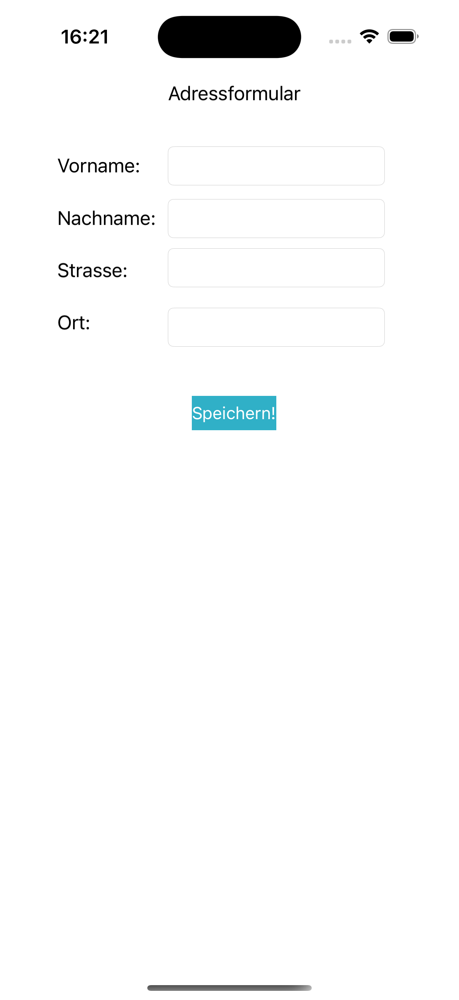
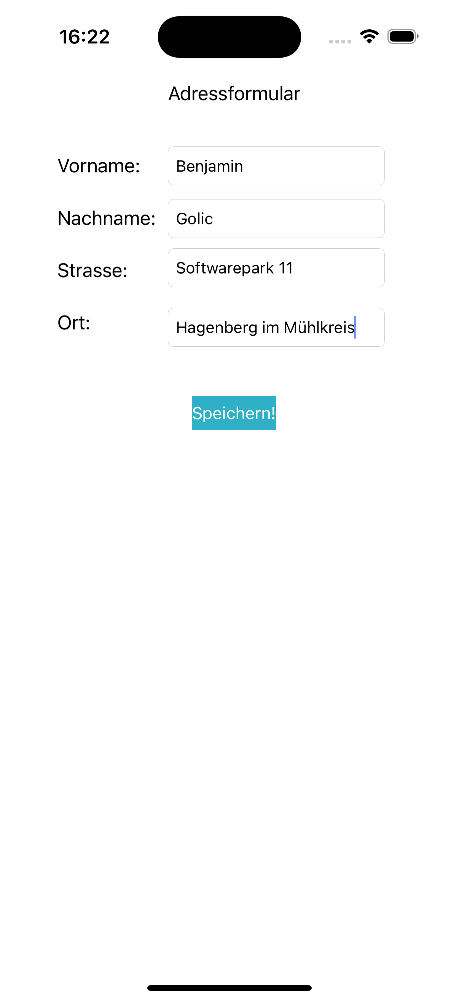
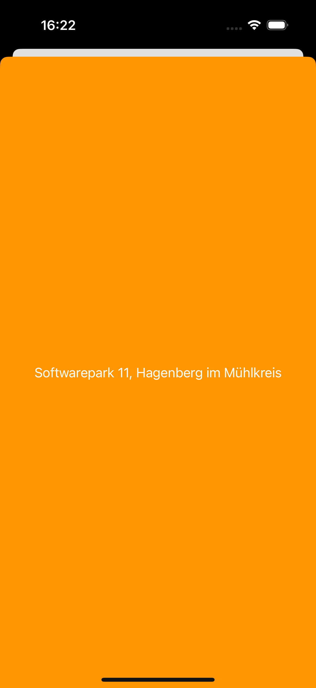

# Adressformular

## Overview
The **Adressformular** project is a simple Swift + UIKit application that demonstrates basic form handling and data passing between two view controllers. 
The user enters their first name, last name, street, and city into a form, and upon clicking "Speichern" (Save), the information is passed to a second screen where the street and city are displayed.

## Features
- Form fields for first name (Vorname), last name (Nachname), street (Strasse), and city (Ort).
- Data validation to check that all fields are filled out before proceeding.
- Button to save and print the form inputs to the console.
- Transition to a second screen (Detail View) where the street and city are displayed.
- MVC pattern is used, with a `Model` class storing user input.

## Screenshots

### Adressformular - Form and Detail Views

    
    
    

## How to Run
1. Clone the repository.
2. Open the project in Xcode.
3. Select the appropriate simulator or device and run the project.
4. Fill in the form fields, press "Speichern", and see the results on the next screen.