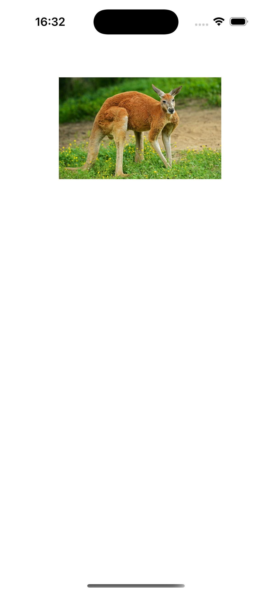

## IconDrag

## Overview
**IconDrag** is a Swift + UIKit project where the user can drag an image of a kangaroo around the screen using a gesture recognizer. This exercise demonstrates how to implement drag-and-drop functionality using `UIPanGestureRecognizer` to move an image view within its superview.

## Features
- Drag and drop functionality for an image view.
- Gesture recognizer to detect user interactions.
- Smooth movement of the image based on the user's drag gesture.

## Screenshots

### Kangaroo Drag Interaction

    
    

## How to Run
1. Clone the repository.
2. Open the `IconDrag` project in Xcode.
3. Select a simulator or device and run the project.
4. Drag the kangaroo image around the screen to interact with the app.

## Code Explanation

- **UIPanGestureRecognizer**: The pan gesture recognizer is attached to the kangaroo image. As the user drags the image, the gesture recognizer calculates the translation and moves the image accordingly.

- **Gesture Handling**: 
  - When the drag begins (`state == .began`), the initial center of the image is recorded.
  - As the gesture continues, the image view's center is updated based on the translation of the drag.
  - If the gesture is cancelled, the image returns to its initial position.

