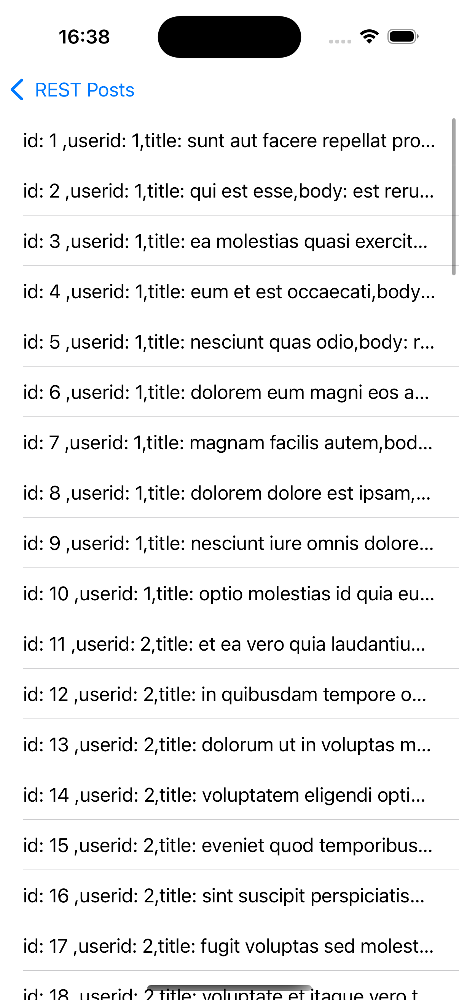

# NSData_Rest

## Overview
The **NSData_Rest** project is a Swift + UIKit application that demonstrates how to fetch data from a REST API and display it in a table view. The app uses `JSONSerialization` to parse data from the [JSONPlaceholder API](https://jsonplaceholder.typicode.com/posts), which provides mock data in the form of posts. The user can press a button to load the posts and view them in a table.

## Features
- Fetch data from a REST API.
- Parse JSON data using `JSONSerialization`.
- Display parsed data in a `UITableView`.
- A button to trigger fetching and displaying the posts.

## Screenshots

### REST API Interaction

    
    

## How to Run
1. Clone the repository.
2. Open the `NSData_Rest` project in Xcode.
3. Select a simulator or device and run the project.
4. Click "Show Posts" to load data from the API and view it in the table.

## Code Explanation

- **Fetching Data**: The app fetches data from the REST API by loading the content of the URL and parsing the JSON response.
  
- **Data Parsing**: 
  - The app uses `JSONSerialization` to convert the raw JSON data into an array of dictionaries.
  - Each dictionary contains keys for `id`, `userId`, `title`, and `body`, which are parsed and stored in a `Post` object.
  
- **Table View**: 
  - After parsing, the posts are stored in a model, and the table view is updated with the post data.
  - Each row in the table view displays the post's ID, user ID, title, and body.
