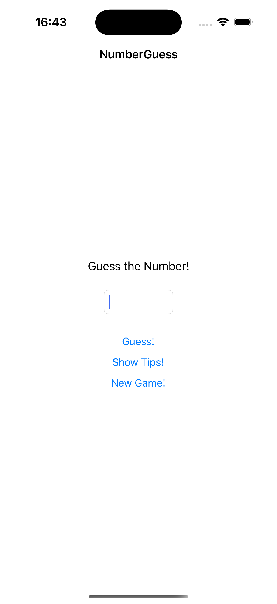

# NumberGuess

## Overview
The **NumberGuess** project is a simple number guessing game built using Swift and UIKit. The user is prompted to guess a random number between 1 and 99, and the game provides hints whether the guess should be higher or lower. The user's guesses are displayed in a list, with correct guesses highlighted in green.

## Features
- Simple number guessing game with higher/lower hints.
- Keeps track of all guesses and displays them in a table view.
- Highlights the correct guess in green and other guesses in red.
- Option to start a new game at any point.
  
## Screenshots

### Guessing Interface and Results

    
    
    
    

## How to Play
1. Enter a number between 1 and 99.
2. Press **Guess!** to check if the number is correct.
   - The game will tell you to guess higher or lower if the guess is wrong.
3. Press **Show Tips** to see all your guesses.
   - Incorrect guesses are marked in red, and the correct guess is marked in green.
4. Press **New Game** to reset the game and generate a new random number.

## How to Run
1. Clone the repository.
2. Open the `NumberGuess` project in Xcode.
3. Select a simulator or device and run the project.
4. Start playing by guessing a number!

## Code Explanation

- **Random Number Generation**: 
  - A random number is generated between 1 and 99 using `Int.random(in: 1..<99)`.
  
- **Guess Tracking**: 
  - Each guess is stored in an array and displayed in a table view.
  - The guesses are colored red for incorrect guesses and green for the correct one.

- **New Game Functionality**: 
  - The user can start a new game at any point, which resets the random number and clears the previous guesses.
